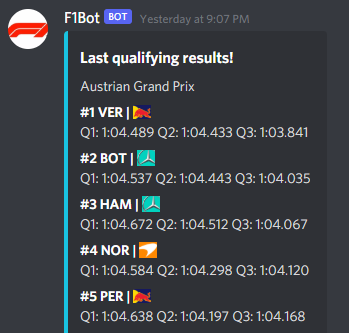

# Formula 1 Discord Bot 

This project allows you to write commands to discord bot which sends you back the most important information about latest Forumla 1 events inlcuding:
* last race results ⟶ !last-race
* last quailfying results ⟶ !last-quali
* constructor standings ⟶ !constructor-standings
* drivers standings ⟶ !drivers-standings
* schedule of events ⟶ !schedule
* next race information ⟶ !next-race

# Functionality to implement
* betting race winners on discord with full leaderboard to play in close communities
* sending notifications about incoming events

# Technologies
All of the data about races is gathered from Ergast Developer API - http://ergast.com/mrd/
## Python modules
* requests
* discord.py
* BeautifulSoup